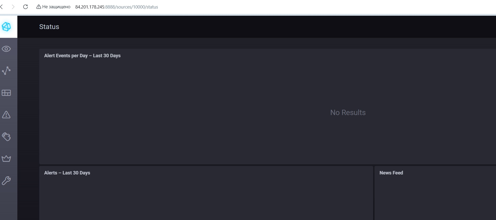
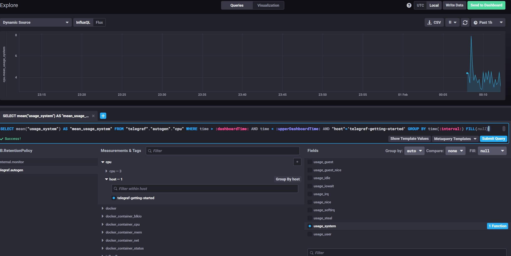
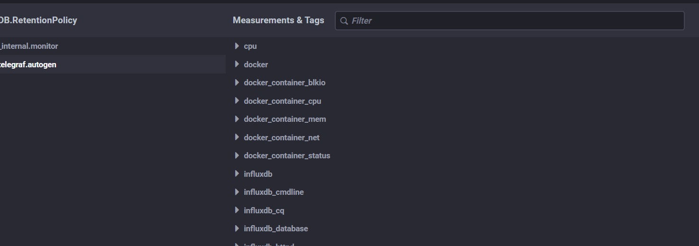

## Решение

1. Поскольку речь идет о вычислениях, сохранении на диск и http выбираю следующие метрики: 
 - CPU
 - RAM/Swap
 - Space utilization
 - Free inodes
 - Process liveness
 - IOPS/IOwait
 - Доступность 80 порта
 - NetTraffice Rx/Tx
 - Healthcheck web-приложения
#

2. RAM – объем используемой оперативная память
Inodes - объем используемых индексные дескрипторы. Заполнение индексных дескрипторов приведет к невозможности записи на файловую системы, даже при наличии свободного диского пространства.
CPUla - показатель , отражающий среднее количество процессов, работающих или ожидающих (CPU, I/O) выполнения за последние 1, 5 и 15 минут, характеризующий нагрузку на CPU и подсистему ввода-вывода

Для заказчика предлагается договориться об SLA.
#

3. Создаем скрипты, которые по периодически (например через cron или systemd timers) по маске ищут в журналах ошибки и отправляет на почту.
#

4. Неправильный расчет, необходимр учитывать также 1xx и 3xx коды ответов. Т.е. формула должна выглядить следующим образом: (summ_1xx_requests + summ_2xx_requests + summ_3xx_requests)/summ_all_requests
#

5. Плюсы и минусы pull и push систем мониторинга.
Push:
+ упрощение репликации данных в разные системы мониторинга или их резервные копии 
+ более гибкая (например объем и частота) настройка отправки пакетов данных с метриками 
+ более удобная модель для динамической среды (данные с агентов будут сами поступать в систему) 
+ Можно настроить UDP — это менее затратный способ передачи данных, из-за чего может возрасти производительность сбора метрик 
- но в этом случае может пострадать гарантия доставки 

Pull:
+ легче контролировать список агентов, которые требуется опрашивать 
+ можно настроить единый proxy server до всех агентов с TLS 
+ упрощённая отладка получения данных с агентов 
- неудобство для динамической среды, например, когда контейнеры могут появляться и исчезать 
#

6. Какие из ниже перечисленных систем относятся к push модели, а какие к pull?

    - Prometheus: pull и push (через pushgateway) 
    - TICK: push
    - Zabbix: push и pull
    - VictoriaMetrics: pull и push
    - Nagios: pull и push
#

7. Веб-интерфейса ПО chronograf.
 
#

8. Скриншот с отображением метрик утилизации cpu из веб-интерфейса:
 
#

9. Метрики, связанные с docker.

